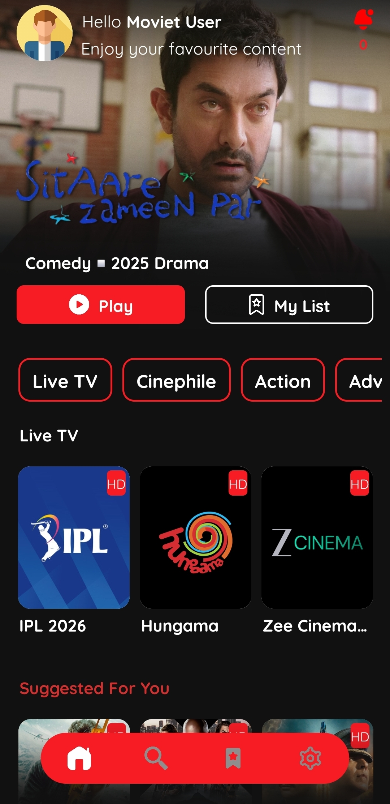
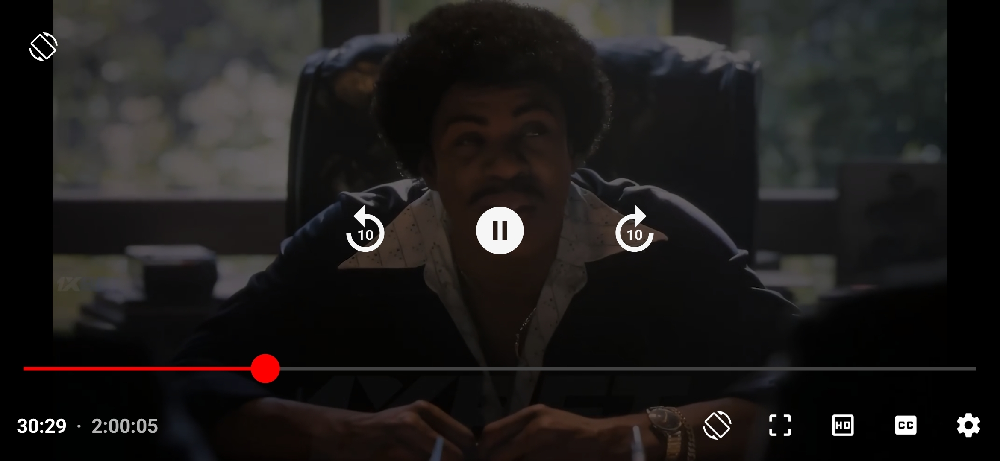
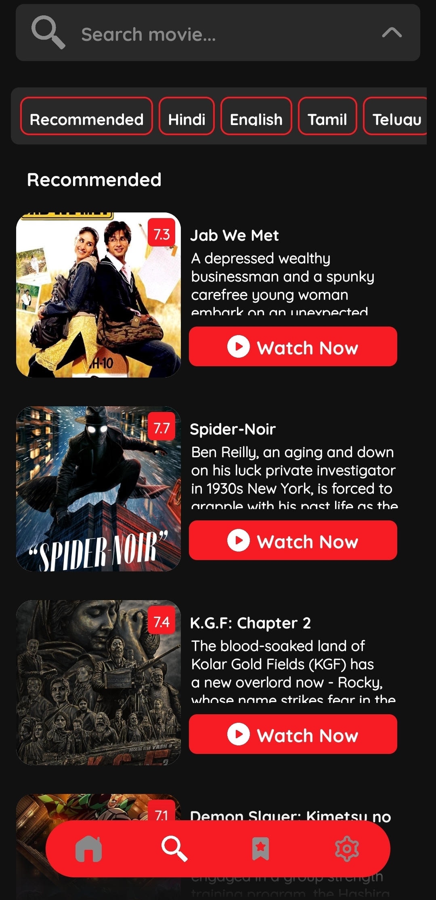
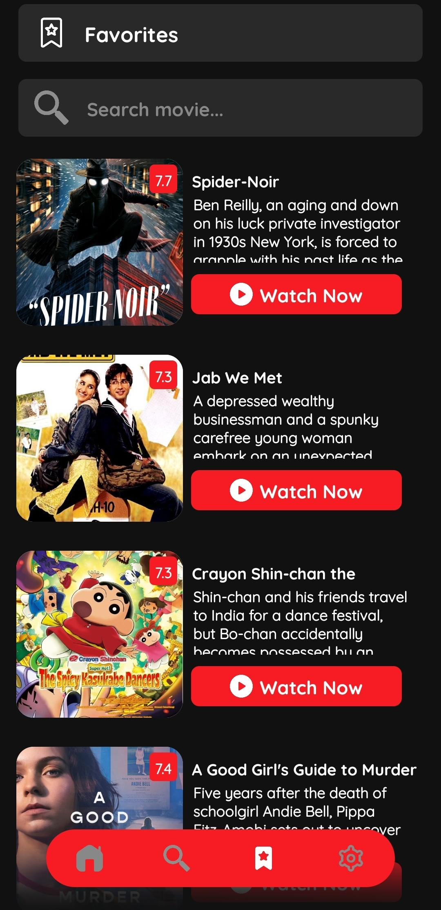
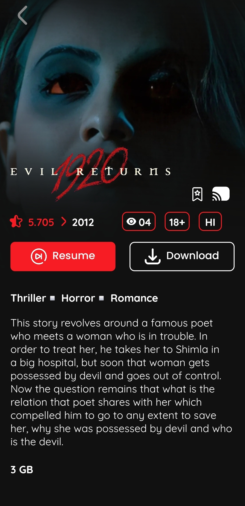
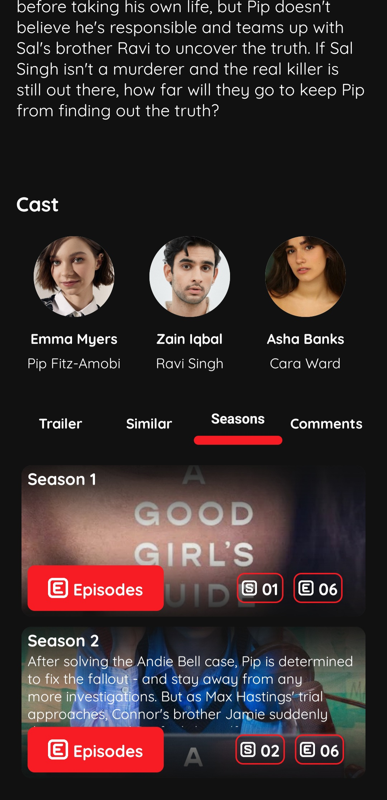
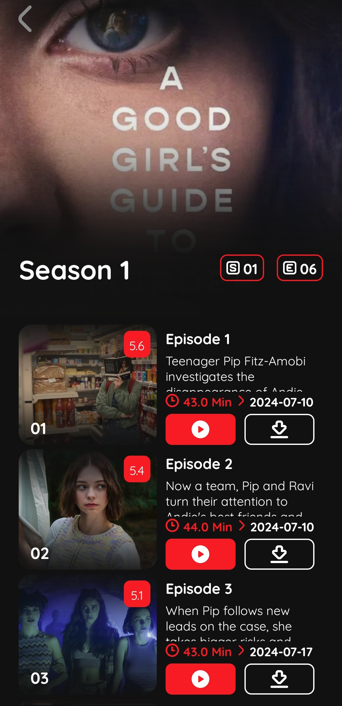
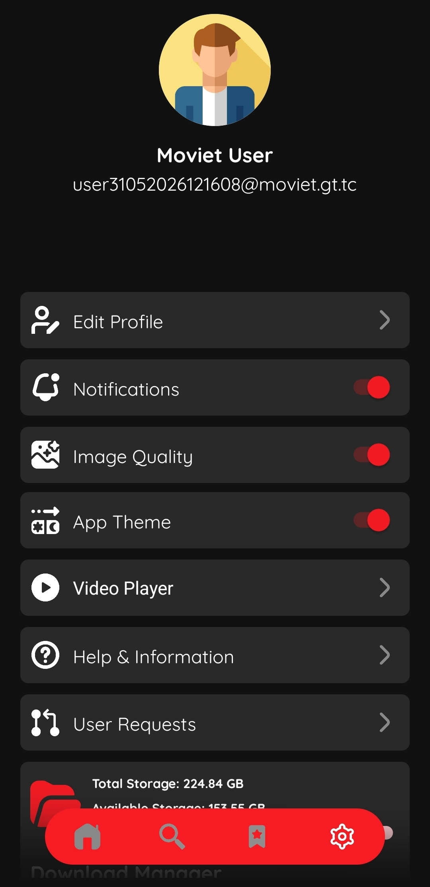
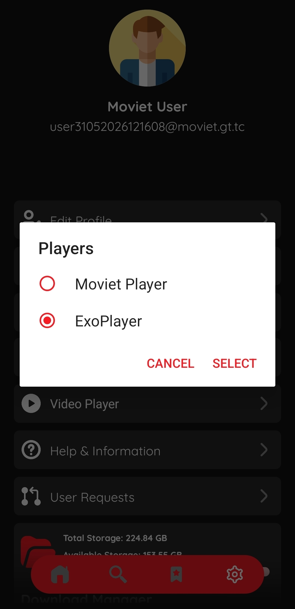

MOVIET V7.0

Premium Entertainment Experience

Modern • Fast • Ad-Free • Multi-Language

---

About Moviet

Moviet V7.0 is a modern entertainment platform designed to provide a seamless streaming experience with a clean interface, powerful playback options, and an extensive content library.

Whether you're looking for the latest releases, timeless classics, critically acclaimed cinema, TV shows, or live sports, Moviet delivers everything in one place with speed, simplicity, and reliability.

---

Features

UI & Experience

- Modern redesigned interface
- Fast and responsive navigation
- Dark Mode & Light Mode
- Clean viewing experience
- Optimized performance

Playback

- Multiple Video Players
- Multiple Streaming Servers
- Fast Loading Streams
- Subtitle Support
- Audio Track Selection
- Reliable Playback Experience

Content Library

- Latest Movie Releases
- Classic Movies
- Critically Acclaimed Films
- Handpicked Cinephile Collection
- Popular Blockbusters
- TV Shows
- Live Sports
- International Content

Multi-Language Support

Many titles include:

- Hindi
- English
- Tamil
- Telugu
- Malayalam
- Additional audio options where available

User Features

- Favorites & Watchlist
- Powerful Search System
- Movie Request Feature
- Download Support
- Personalized Experience

Performance

- Multiple High-Speed Servers
- Better Availability
- Faster Streaming
- Optimized Resource Usage
- Smooth User Experience

---

Why Moviet?

✔ Modern Design

✔ Ad-Free Experience

✔ Multiple Audio Options

✔ Subtitle Support

✔ Download Capability

✔ Live Sports Streaming

✔ TV Shows Collection

✔ Favorites & Watchlist

✔ Fast Search

✔ Reliable Servers

✔ Constantly Updated Library

---

What's New In V7.0?

- Complete UI Refinement
- Improved Navigation
- Enhanced Streaming Performance
- Multi-Audio Support Expansion
- Better Subtitle Handling
- New Favorites System
- Improved Download Experience
- Faster Search Engine
- Additional Streaming Servers
- General Stability Improvements

---

Screenshots

  ## Screenshots

  
  
  
  
  
  
  
  
    
    

Download

Get the latest version of Moviet V7.0

"Download Moviet" (#)

---

Experience Entertainment Without Limits

MOVIET V7.0

